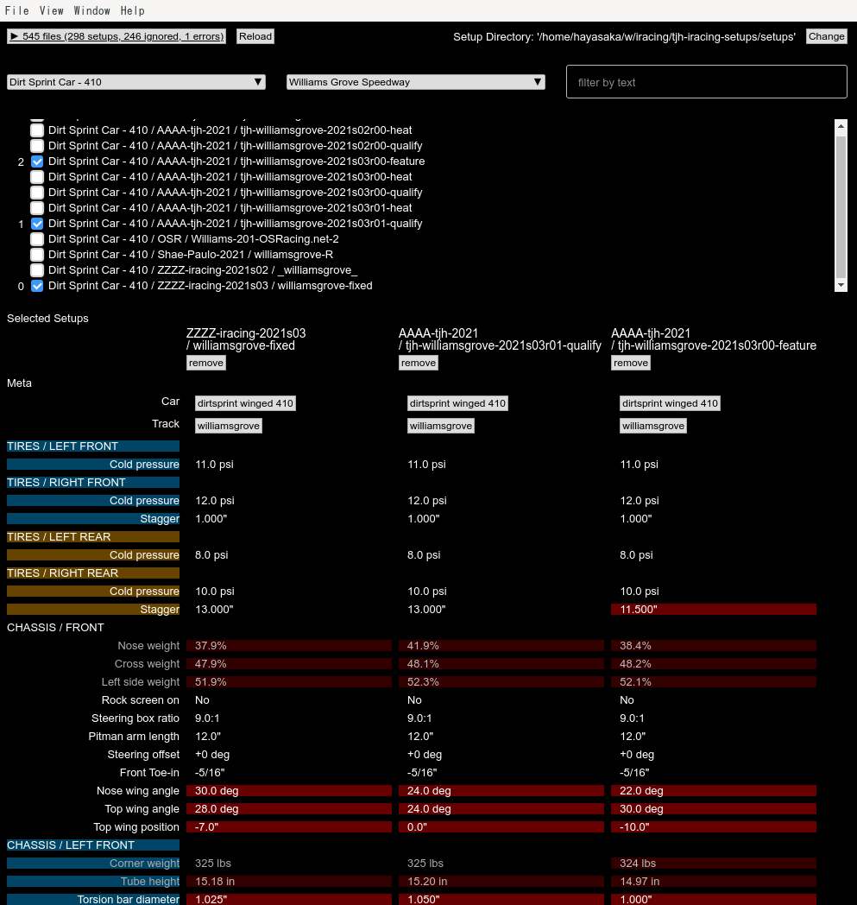
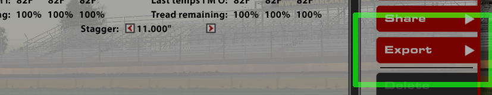

iracing-setup-diff - Yet Another iRacing Setup Diff/Comparison Tool
===================================================================

This is a desktop application on Windows that shows a comparison table of exported iRacing setup files.

Tested for dirt (oval and road) cars and tracks only.

Download
--------

   Go to [Releases page on github](https://github.com/tjhayasaka/iracing-setup-diff/releases) and download the latest "iracing-setup-diff-*.Setup.exe".

Usage
-----

  - Export your setups in iRacing sim:

    * Launch the iRacing sim with correct car and track.

    * Load a setup you want to export.

    * Export it.  You can export it in the same directory (recommended), or in separate directory (not recommended, as you need to specify the directory everytime on export).

      

  - Launch iracing-setup-diff.

    * The program scans exported setup files in standard iRacing setup directory ("Documents/iRacing/setups/") and shows a list in the window.

    * If you have exported files in other locations, specify it by pressing "change" button.
      

How Cars/Tracks are Determined
------------------------------

An exported setup file describes the targeted car and track using specially abbreviated names.
To display long name of cars and tracks (e.g. "USA International Speedway - Dirt" instead of "lakeland dirt"),
the program matches the abbreviated names against the known cars/tracks list,
and if none found, an error is raised.

The file name (including the directory part) of the exported setup file is not used.

The known cars/tracks list is defined in src/Master.elm.  But the list is incomplete and incorrect especially for non-dirt tracks because:

  - The list is generated from another source (https://members.iracing.com/membersite/member/Cars.do) but the abbreviation rules are different between the setup and (Cars.do + list generator).

  - Cars.do contains data about all individual tracks, but doesn't contain data about not owned track packages, and track configuration names appear only in packages.  For non-dirt tracks, I purchased only a few, so this causes incompleteness.

Special "Baseline" File Names
-----------------------------

If the filename of a setup matches any of following criteria, the setup is considered as a track agnostic "baseline":

  - The filename contains `baseline`.

  - The filename is one of

    * `_rallycross_`
    * `_roadcourse_`
    * `_(low|medium|high|maximum)_downforce_(sprint_|endurance_)?`
    * `_(sprint|endurance)_`.

These rules are hard coded.  See src/SetupParser.elm for more details.

Using The Source Code
---------------------

Prerequisites:

  - git for Windows - https://gitforwindows.org/ (for git-bash.  not required on Linux)
  - node.js and npm - https://nodejs.org/en/download/

Other required packages ([elm](https://elm-lang.org/) and [electron](https://www.electronjs.org/) stuff) are listed in electron/package.json.

To run the app on Windows, you need to set npm to use bash (because the scripts in package.json is written in bash):

    (cd electron && npm config set script-shell $(which bash) )

Building:

    (cd electron && npm run build-watch)

or

    (cd electron && npm run build-dev-watch)   # no optimization and symbol mangling

Running:

    (cd electron && npx electron .)

To make a package (an installer *.exe):

    (cd electron && npm build && npm run make)   # "./electron/out/make/squirrel.windows/x64/iracing-setup-diff-1.0.0 Setup.exe" is generated

For other `npm run` targets, see electron/package.json.

Other iRacing Setup Tools in The Universe
-----------------------------------------

  - iRacing Setup Sync - https://iracingsetupsync.nickthissen.nl/

  - iRacing SetupDiffer - https://svappslab.com/iRacing/SetupDiffer

  - iRacing Setup Manager - https://sites.google.com/site/irsetman/

  - Setup Viewer for iRacing - http://mysimracingapps.ratbrat.net/ (I don't know whether you can use it for diffing)

Colophon
--------

GL HF DS
